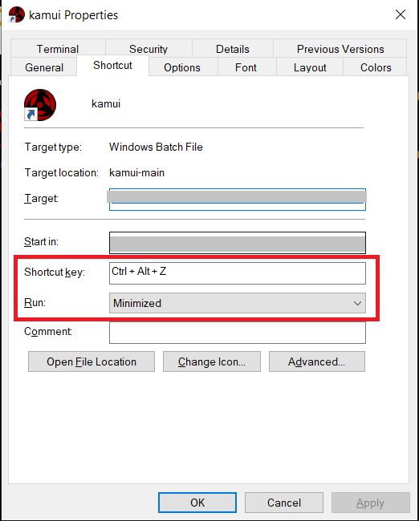

# kamui
## Credits
I have obvioulsy copied code and tweaked it for my purpose. I would like to give the credits to sources from where i have copied the code
1. [Demo scripts from pysimplegui github]((https://github.com/PySimpleGUI/PySimpleGUI/blob/master/DemoPrograms/Demo_Input_Auto_Complete.py))
1. [stackoverflow link ] FIXME: add the link here.  
Name `kamui` is inpired from the kamui used by the uchihas in the Naruto shipuden.
May be the lord fourth teleportation jutsu name can also be a best fit.
## What is this actually ?
In short this can be a speed dail to your computer. 
Show kamui few places to go and it will help you teleport to those places. 
Save the shortcut and you can reach to the desitnation faster with the help of the Kamui.
One can 
1. visit a website
1. open a folder location 
1. open a file.
Currently it is only capable to do only these things and in future its capabilities might be extended (fingers crossed).
Contributions are welcome!
## How to setup kamui in your system?
There are two steps
1. Creating custom shortcut
1. Adding details into options.json 
### Creating custom shortcut
### Windows
For those who can execute python files by just cliking on them ([similar thread](https://stackoverflow.com/questions/11472843/set-up-python-on-windows-to-not-type-python-in-cmd)) follow the below procedure.
1. Create a shortcut icon for kamui.py
1.   
Set the defined short cut which you want. Unfortunatley in windows it always has to be CTRL+ALT+ *your desired key*
1. Thats it. You are all set.

For those who cannot execute python files by just clicking on the file .
1. Create a .bat file which can run the python file. For example `python  full/path/to/location/of/kamui.py`
1. Create a shortcut icon for the bat file.
1.   
Set the defined short cut which you want. Unfortunatley in windows it always has to be CTRL+ALT+ *your desired key*
1. Thats it. You are all set.

### Linux
Create a custom shortcut which can execute the command `python  full/path/to/location/of/kamui.py`. 
Creating a custom shortcut is similar in all the linux distros.
[A reference link to ubuntu on how to create a custom shortcuts.](https://help.ubuntu.com/stable/ubuntu-help/keyboard-shortcuts-set.html)
### Adding details into options.json file.
Kamui uses the default apps set in the operating system to open link.
One need to edit the options.json file to add their paths/files/links.
At the moment Kamui can 
1. open a web link.
1. Can open a folder locaiton in file explorer.
1. Can open a file.

This readme assumes that you are familiar with JSON format already. Below is an example options.json file content

```json
//options.json file content
{
    "YT": {
        "type": "link",
        "value": "www.youtube.com"
    },
    "google": {
        "type": "link",
        "value": "www.google.com"
    },
    "mypic":{
        "type": "file",
        "value": "C:/Users/user_1/Downloads/passportsizepic.png"  // always remember to use forward slash
    },
    "users folder": {
        "type": "file",
        "value": "C:/Users/user_1/Downloads/"  // always remember to use forward slash
    }
}
```
## Why kamui takes lot of time to start ?
Kamui can sometimes be slow and it is not because of a the script, its because of windows.
Continue reading for detailed answer.

### Reason behind Kamui being slow.
From the [stackoverflow link](https://superuser.com/questions/426947/slow-windows-desktop-keyboard-shortcuts#:~:text=1%20Start%20Windows%2C%20then%20before%20opening%20any%20other,gone%20away.%204%20Still%20have%20a%20delay%3F%20)
```
Before launching a program via its shortcut key, Windows first polls all currently running programs and asks "Is this your shortcut key?" If so it switches focus to that window rather than spinning up a new copy of the program.
```
so switch off the back ground process which are not really usefull for you. I really would not have my calculator running in background 
i mean what is the calculator app doing in the background ? 🤨.

### How to switch off background apps in windows
1. Hit windows button
1. Enter `Background apps`
1. Switch off whatever is not needed for you.
1. You shall now see improvement in its speed. 

### Isnt this a problem for linux ?
No this is not a problem for linux.

## Limitations
1. During a Microsoft teams screen sharing session, Kamui is not being invoked if the screen that is being shared is your primary screen/monitor. The reason behind this is still being investigated.
1. Kamui does not complain if file/location is not present.Instead it simply exits. There is a plan to implement this in the near future

## License
[license](./LICENSE)
